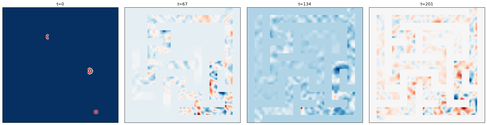

# Acoustic Scattering - Maze

**One line description of the data:** Simple acoustic wave propagation through maze-like structures.

**Longer description of the data:** These variable-coefficient acoustic equations describe the propogation of an acoustic pressure wave through maze-like domains. Pressure waves emerge from point sources and propogate through domains consisting of low density maze paths and orders of magnitude higher density maze walls. This is built primarily as a challenge for machine learning methods, though has similar properties to optimal placement problems like WiFi in a building. 

**Domain expert**: [Michael McCabe](https://mikemccabe210.github.io/), Polymathic AI.

**Code or software used to generate the data**: Clawpack, adapted from [this code](http://www.clawpack.org/gallery/pyclaw/gallery/acoustics_2d_interface.html).

**Equation**:
$$
\frac{ \partial p}{\partial t} + K(x, y) \left( \frac{\partial u}{\partial x} + \frac{\partial v}{\partial y} \right) = 0 
$$
$$
\frac{ \partial u  }{\partial t} + \frac{1}{\rho(x, y)} \frac{\partial p}{\partial x} = 0 
$$
$$
\frac{ \partial v  }{\partial t} + \frac{1}{\rho(x, y)} \frac{\partial p}{\partial y} = 0 
$$

with $\rho$ the material density, $u, v$ the velocity in the $x, y$ directions respectively, $p$ the pressure, and $K$ the bulk modulus. 

Example material densities can be seen below:


Traversal can be seen:


| Dataset    | FNO | TFNO  | Unet | CNextU-net
|:-:|:-:|:-:|:-:|:-:|
| acoustic_scattering_maze  | 1.00 | 1.00| 1.00| $\mathbf{0.173}$|

# About the data

**Dimension of discretized data:** $201$ steps of $256\times256$ images.

**Fields available in the data:** pressure (scalar field), material density (constant scalar field), material speed of sound (constant scalar field), velocity field (vector field).

**Number of trajectories:** 2000.

**Estimated size of the ensemble of all simulations:** 311.3 GB.

**Grid type:** uniform, cartesian coordinates.

**Initial conditions:** Flat pressure static field with 1-6 high pressure rings randomly placed along paths of maze. The rings are defined with variable intensity $\sim \mathcal U(3., 5.)$ and radius $\sim \mathcal U(.01, .04)$. Any overlap with walls is removed. 

**Boundary conditions:** Open domain in $y$, reflective walls in $x$.

**Simulation time-step:** Variable based on CFL with safety factor .25. 

**Data are stored separated by ($\Delta t$):** 2/201. 

**Total time range ($t_{min}$ to $t_{max}$):** [0,4].

**Spatial domain size ($L_x$, $L_y$, $L_z$):** [-1, 1] x [-1, 1].

**Set of coefficients or non-dimensional parameters evaluated:**
$K$ is fixed at 4.0. 

$\rho$ is the primary coefficient here. We generated a maze with initial width between 6 and 16 pixels and upsample it via nearest neighbor resampling to create a 256 x 256 maze. The walls are set to $\rho=10^6$ while paths are set to  $\rho=3$.  

**Approximate time to generate the data:** ~20 minutes per simulation. 

**Hardware used to generate the data and precision used for generating the data:** 64 Intel Icelake cores per simulation. Generated in double precision.

# What is interesting and challenging about the data:

This is an example of simple dynamics in complicated geometry. The sharp discontinuities can be a significant problem for machine learning models, yet they are a common feature in many real-world physics. While visually the walls appear to stop the signal, it is actually simply the case that the speed of sound is much much lower inside the walls leading to partial reflection/absorbtion at the interfaces. 
<!-- 
### Visualize the `acoustic_scattering_maze` dataset


```python
import numpy as np
import matplotlib.pyplot as plt
import h5py
import glob
import os
```


```python
#print the list of paths of files in the training set
set_path = 'train'
paths = sorted(glob.glob(f'data/{set_path}/*.hdf5'))
print(paths)
```
```
    ['data/train/acoustic_scattering_maze_2d_chunk_0.hdf5', 'data/train/acoustic_scattering_maze_2d_chunk_1.hdf5', 'data/train/acoustic_scattering_maze_2d_chunk_10.hdf5', 'data/train/acoustic_scattering_maze_2d_chunk_11.hdf5', 'data/train/acoustic_scattering_maze_2d_chunk_12.hdf5', 'data/train/acoustic_scattering_maze_2d_chunk_13.hdf5', 'data/train/acoustic_scattering_maze_2d_chunk_14.hdf5', 'data/train/acoustic_scattering_maze_2d_chunk_15.hdf5', 'data/train/acoustic_scattering_maze_2d_chunk_2.hdf5', 'data/train/acoustic_scattering_maze_2d_chunk_3.hdf5', 'data/train/acoustic_scattering_maze_2d_chunk_4.hdf5', 'data/train/acoustic_scattering_maze_2d_chunk_5.hdf5', 'data/train/acoustic_scattering_maze_2d_chunk_6.hdf5', 'data/train/acoustic_scattering_maze_2d_chunk_7.hdf5', 'data/train/acoustic_scattering_maze_2d_chunk_8.hdf5', 'data/train/acoustic_scattering_maze_2d_chunk_9.hdf5']
```


```python
#select the first path (arbitrary choice)
p = paths[0]

#print the first layer of keys
with h5py.File(p,'r') as f:
    print(f.keys())
```

    <KeysViewHDF5 ['boundary_conditions', 'dimensions', 'scalars', 't0_fields', 't1_fields', 't2_fields']>


```python
# In 'boundary_conditions' is stored the information about the boundary conditions:
with h5py.File(p,'r') as f:
    print('print bc available:', f['boundary_conditions'].keys())
    print('print attributes of the bc:', f['boundary_conditions']['x_wall'].attrs.keys())
    print('get the bc type:', f['boundary_conditions']['x_wall'].attrs['bc_type'])
```

    print bc available: <KeysViewHDF5 ['x_wall', 'y_open']>
    print attributes of the bc: <KeysViewHDF5 ['associated_dims', 'associated_fields', 'bc_type', 'sample_varying', 'time_varying']>
    get the bc type: WALL


```python
#Reminder: 't0_fields', 't1_fields', 't2_fields' are respectively scalar fields, vector fields and tensor fields
#print the different fields available in the dataset
with h5py.File(p,'r') as f:
    print('t0_fields:', f['t0_fields'].keys())
    print('t1_fields:', f['t1_fields'].keys())
    print('t2_fields:', f['t2_fields'].keys())
```

    t0_fields: <KeysViewHDF5 ['bulk_modulus', 'density', 'pressure']>
    t1_fields: <KeysViewHDF5 ['velocity']>
    t2_fields: <KeysViewHDF5 []>


```python
#The data is of shape (n_trajectories, n_timesteps, x, y)
#Get the first t0_field and save it as a numpy array
with h5py.File(p,'r') as f:
    pressure = f['t0_fields']['pressure'][:] #HDF5 datasets can be sliced like a numpy array
    print(f'shape of the selected t0_field: ', pressure.shape)   

    #you can directly slice the selected field without reading the whole dataset by doing:
    #traj = 0 #select the trajectory
    # field = f['t0_fields']['concentration'][traj, :] 
```

    shape of the selected t0_field:  (100, 202, 256, 256)


```python
#field is now of shape (n_timesteps, x, y). 
traj = 1
traj_toplot = pressure[traj,...] 
# Let's do a subplot to plot it at t= 0, t= T/3, t= 2T/3 and t= T:
fig, axs = plt.subplots(1, 4, figsize=(20,5))
T = traj_toplot.shape[0]

#same colorbar for all subplots:
normalize_plots = False
cmap =  'RdBu_r'

if normalize_plots:
    vmin = np.nanmin(traj_toplot)
    vmax = np.nanmax(traj_toplot)
    norm = plt.Normalize(vmin=vmin, vmax=vmax)
    for i, t in enumerate([0, T//3, (2*T)//3, T-1]):
        axs[i].imshow(traj_toplot[t], cmap=cmap, norm=norm)
        axs[i].set_xticks([])
        axs[i].set_yticks([])
        axs[i].set_title(f't={t}')
else:
    for i, t in enumerate([0, T//3, (2*T)//3, T-1]):
        axs[i].imshow(traj_toplot[t], cmap=cmap)
        axs[i].set_xticks([])
        axs[i].set_yticks([])
        axs[i].set_title(f't={t}')
plt.tight_layout()


```


    

    
 -->
